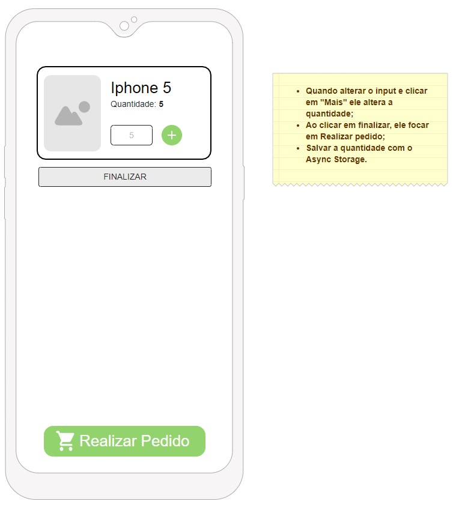
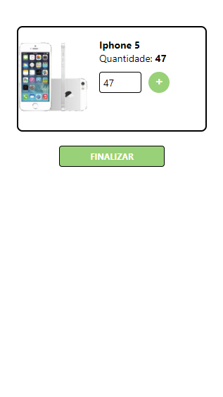

<h1 align="center">Atividade React Hooks

 </h1>
<h2> Descrição </h2>
Utilizar o conceito do useState, useEffect e useRef. Em anexo na imagem explicação sobre o que deve ser desenvolvido.

    <h3>Modelo e Resultado:</h3>
    
    

