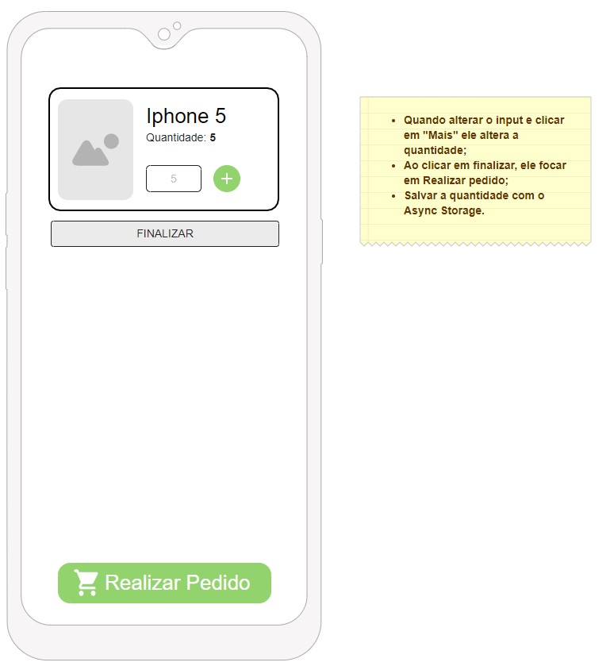
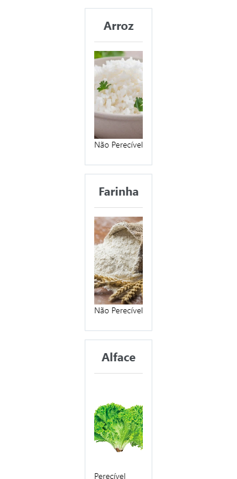

<h1 align="center"> Atividade conceitos API REST- React Native </h1>
<h2> Descrição </h2>
Desenvolver um tela utilizando o retorno das informações utilizando REST e a biblioteca do Axios. Em anexo protótipo.

    

<h2> Resultado </h2>

    

